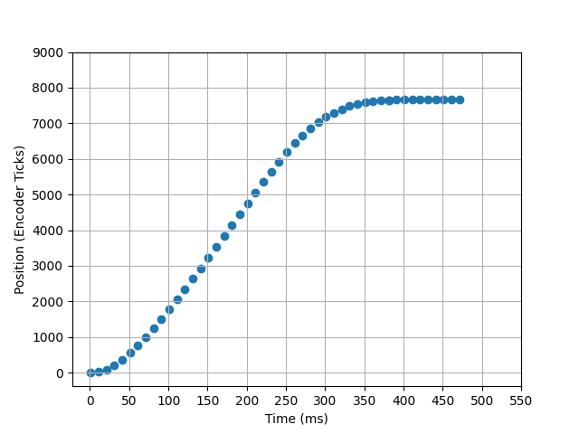
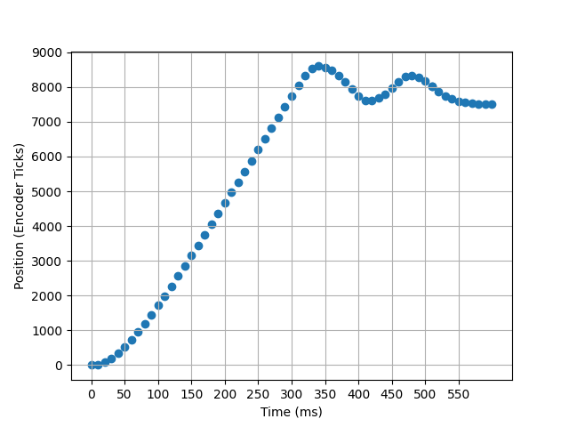
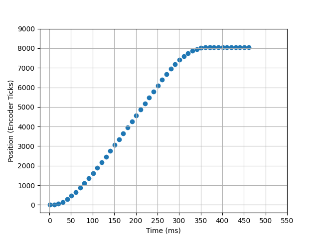

<h1>ME 405 Lab 3</h1>
Scott Frizzell and Jacques Lacroix

This repository contains the classes necessary to run a closed loop, proportional controller for a DC motor using a quadrature encoder.
The controller is setup to accept a proportional gain coefficient over serial communication from `desktop.py`, run a step response, then send the data back to `desktop.py` to be plotted.

To run the step response, connect and upload `controller.py`, `encoder_reader.py`, `motor_driver.py`, and `main.py` to a Nucleo board. Run `desktop.py` locally. Clicking the `Run` button will prompt the user to enter a KP value in the terminal window. After pressing enter, the controller will perform a step response. The data will then be displayed on the plot. Multiple trials may be run and plotted against each other, or all trials can be cleared by clicking `Clear`.

Example step responses are shown below:

<h3>Underdamped Response</h3>
The following step response was performed with a KP value of 0.3

<h3>Excessive Oscillation</h3>
The following step response was performed with a KP value of 0.8

<h3>Best Performance</h3>
The following step response was performed with a KP value of 0.43

